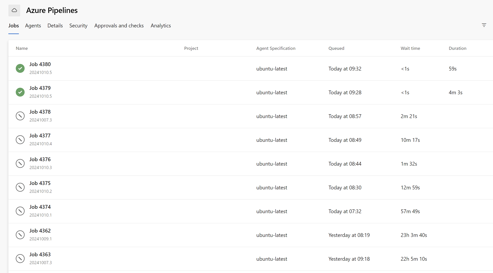
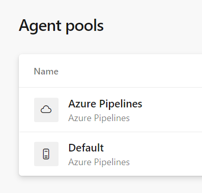
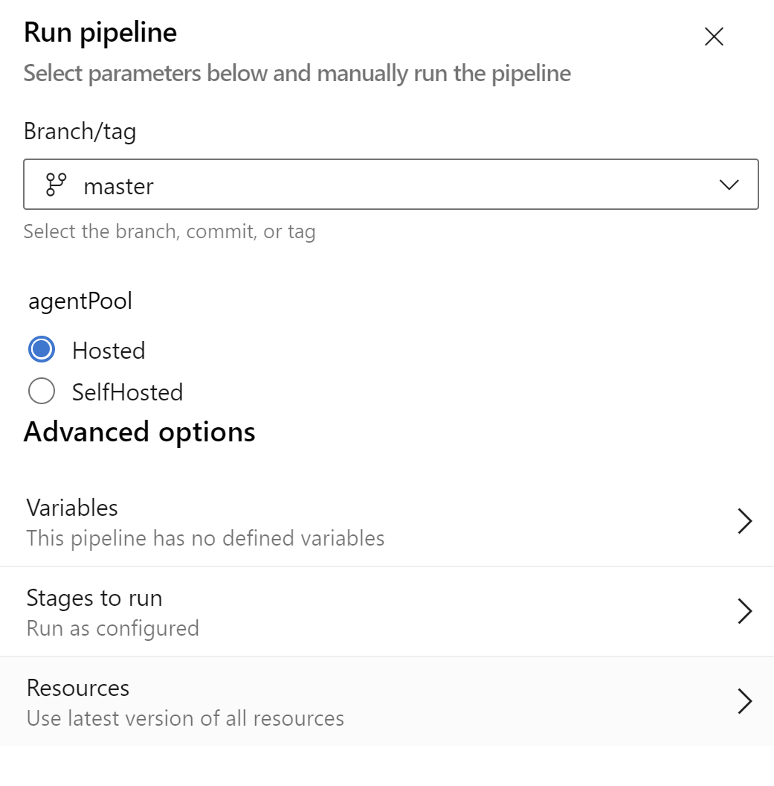

# Azure Devops pipeline frozen in queue

There is a bug in Azure DevOps pipelines causes jobs and tasks to remain in the queue without being handled by any agent, even when a free agent is available and sufficient free-tier minutes remain.




## Note
Attempts to resolve the issue, such as enabling/disabling the agent or removing and re-adding the agent pool, did not suffice, and the pipelines remained frozen for nearly a week.

## Temporary workaround
A temporary solution was to deploy a self-hosted agent. However, due to limited resources and the high number of pipelines needing modifications, this workaround was only applied to a single test pipeline.





Part of pipeline with a possibility to select an agent pool:

```yaml
parameters:
- name: agentPool
  type: string
  default: 'Hosted'  
  values:
    - 'Hosted'
    - 'SelfHosted'

stages:
  - stage: Build_frontend
    displayName: Build frontend
    pool:
      ${{ if eq(parameters.agentPool, 'Hosted') }}:
        vmImage: 'ubuntu-latest'
      ${{ if eq(parameters.agentPool, 'SelfHosted') }}:
        name: 'default' #pool name
    jobs:
      - job: Build
        displayName: Build
        steps:
        - checkout: frontend-repo
```

## Solution that worked for me

1. Find an ID of pool that is not working (we are talking about free hosted Azure DevOps pool "Azure Pipelines")
```
GET https://dev.azure.com/{orgName}/_apis/distributedtask/pools?api-version=7.1-preview.1
```
2. Find an ID of the agent that is not working
```
GET https://dev.azure.com/{orgName}/_apis/distributedtask/pools/{poolId}/agents?api-version=7.1-preview.1
```

Part of working agent response - if your agent is frozen, the `provisioningState` should differ from `Deallocated`
```json
{
    "name": "Hosted Agent",
    "version": "3.245.0",
    "osDescription": "Linux 6.5.0-1025-azure #26~22.04.1-Ubuntu SMP Thu Jul 11 22:33:04 UTC 2024",
    "enabled": true,
    "status": "offline",
    "provisioningState": "Deallocated",
    "accessPoint": "CodexAccessMapping"
}
```

3. Update the provisioning state of the agent

```json
PATCH https://dev.azure.com/{orgName}/_apis/distributedtask/pools/{poolId}/agents/{agentId}?api-version=7.1-preview.1
{
    "Id": agentId,
    "ProvisioningState": "Deallocated"  
}
```
